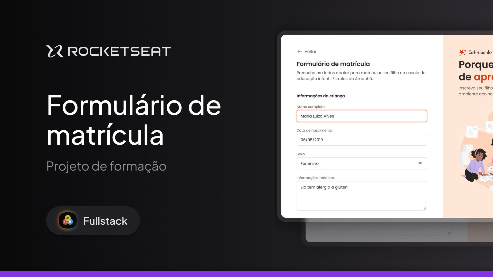

# Formulário de matrículas

O projeto é um formulário de matrícula de uma escola infantil fictícia

## Preview

  

Acesse o projeto online:

[https://vitorcosta2612.github.io/formulario-de-matriculaportfolio-dev/](https://vitorcosta2612.github.io/formulario-de-matricula/)

## Tecnologias utilizadas

* HTML
* CSS
* GitHub Pages

## Objetivo do projeto

O principal objetivo deste projeto foi praticar conceitos de front-end.

Durante o desenvolvimento, foram trabalhados conceitos como:

* Estruturação de páginas com HTML
* Formulários HTML
* Estilização com CSS
* Responsividade
* Organização visual de conteúdo
* Uso de grids e flexbox
* Hierarquia de informações
* Reprodução de layouts inspirados em sites reais

## Autor

Desenvolvido por Vitor Costa.
